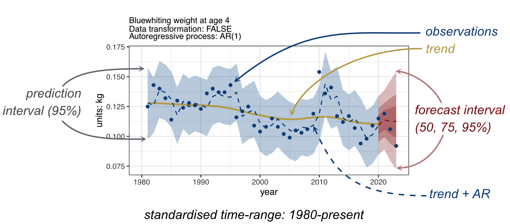

```{r, knitr, echo=FALSE, message=FALSE, warning=FALSE}
library(knitr)
#opts_chunk$set(echo=FALSE, message=FALSE, warning=FALSE,
#  fig.width=6, fig.height=5, out.width="90%", fig.pos='!hbt')
library(officedown)
library(officer)
library(flextable)
```

```{r outputs, echo=FALSE}
load("./output/tables.Rdata")
```

## Principles

In the ATAC analysis, the idea is to model trends (and eventually autoregressive processes, AR) for each individual time-series. This is done for a standardised period of time, here from 1980 to 2021. The models are used to estimate the prediction errors, which are presented as the 95% confidence bands of prediction. The same models are then used to produce forecasts, and associated forecasting errors (or forecasting bands) for the last years of the time-series. When recent observations are available, these can be compared to the expected forecast values and forecast bands.\
The interpretation is done in two ways:\
- The long-term evolution of each time-series is interpreted based on the estimated trend and autoregressive process. This highlights if the series has been e.g. increasing, decreasing or following other long-term patterns. It also highlights if there is a short term 'memory' in the time series (i.e. the value observed in one year depends on the value(s) observed in the preceding year(s).\
- The recent changes are addressed by comparing the recent observations (in the most recent years) against the forecasts/forecast bands. If the forecasts lie within the forecast bands, they were "expected" based on earlier trends & AR & prediction errors. If they are outside the forecast bands, they indicate that the recent observations in the time-series are departing from the earlier trend.\
The modelling is done with the [BRMS package](https://paul-buerkner.github.io/brms/). The plotting is done using the [ggplot2 package](https://ggplot2.tidyverse.org)

## Modelling of the trends, prediction and forecasting bands for the period 1980-present using the brms package

This is done using the following steps:\
1. three models are constructed for each time-series:\
- a GAM model (splines) without autoregressive process: *brm(y \~ s(x))*\
- a GAM model (splines) with autoregressive process AR(1): *brm(y \~ s(x), autocor = cor_ar(p=1))*\
- a GAM model (splines) with autoregressive process AR(2): *brm(y \~ s(x), autocor = cor_ar(p=2))*\
2. the best of the three models is selected, based on the LOO (Leave One Out criteria)\
3. the trend and predictions are calculated.\
4. the prediction percentiles for 2.5%, 12.5%, 25%, 75%, 87.5%, 97.5% are calculated.\
5. a new "truncated" model is fitted to the time-series up to 2021. This model has the same form (ie., same AR process) as the best model fitted on the whole time series. \n
6. the truncated model is used to make forecasts for 2022, 2023 and 2024.\
7. the forecasts and forecast bands (50%, 75% and 95%) are calculated.\
8. the full model, the truncated model, the trends, predictions and forecasts are archived.\
Note that for all models we assume a Gaussian distribution of the errors. For some time-series that depart from normality the original data have been pre-transformed using a double square root. This provides a useful rescaling of the data which is expected to function well for models that assume normality. For time-series shorter than 20y, the models with AR process are not fitted because the estimation of AR coefficients is unreliable. In those cases, the trend-only model is selected by default.

## Standardised time-series graphs

The standardised representation is highlighted in Figure \@ref(fig:ATACprinciples). Each plot corresponds to one time-series for the WGINOR set, with the following:\
- observations shown as blue dots\
- the truncated trend (without AR) shown as a dark yellow plain line.\
- the truncated model (= trend+AR) shown as a blue dashed line. If there is no AR process the trend and the model sit on top of each other.\
- the 95% prediction band for the period 1980 to 2020 indicated as a grey ribbon.\
- the forecasts values for the period 2021 to 2023 indicated as a dark red line.\
- the forecast bands for 50%, 75% and 95% indicated as dark/medium/light red ribbons.\
When the observations in the last three years are on the edge or outside the forecast bands, this can be interpreted as a departure (a stall) for the trend in recent years.

```{r ATACprinciples, echo=FALSE, fig.cap="An example of ATAC results highlighting the different graphical elements used for the interpretation of temporal changes.", fig.height=3, fig.width=6}

```

## Results

```{r ATACfigures, echo=FALSE, fig.height=8.49, fig.width=6}
fig2plot <- file.path(".","report",list.files("report")) # list of figure files in the report directory
include_graphics(fig2plot)
```
